# 广州南沙“8+2+3”现代化产业体系深度分析报告

## 执行摘要

截至 2026-05-16，南沙官方已经明确给出“8+2+3”现代化产业体系完整清单，而非仅停留在概念表述：即**八个战略性新兴产业**、**两个现代服务业**、**三个未来产业**。官方最新公开口径来自南沙区投资促进局 2025-11-27 发布的《广州南沙产业结构》页面，2026-03 公布的《2025年国民经济和社会发展计划执行情况与2026年计划草案的报告》再次确认南沙正“紧密对接市‘12218’产业体系，聚焦构建‘8+2+3’现代化产业体系”。这意味着“8+2+3”已经从招商口径上升为区级产业组织框架。citeturn44view0turn27view0turn35search0

从发展阶段看，南沙这套体系并不是平均用力，而是呈现出明显的“**强支柱 + 强开放 + 强未来**”结构：智能网联与新能源汽车已被官方界定为“两千亿级集群”；船舶与海洋工程、新能源与新型储能、生物医药与健康、绿色石化与新材料已形成四个**300亿元以上**产业集群；而现代金融与物流供应链则构成产业系统的“资金—贸易—通道”底座；未来产业则押注智能无人系统、细胞与基因、深海深空三条高不确定性但高战略价值的赛道。citeturn44view0turn24view0turn27view0

从量化表现看，南沙 2021—2025 年 GDP 由 **2131.61 亿元**增至 **2402.26 亿元**，五年复合增速约 **3.0%**；但产业运行并非单边上升，而是经历了 2024 年的明显调整：官方披露 2024 年 GDP **2301.3 亿元，同比下降 2.3%**，规上工业总产值 **3422.21 亿元，同比下降 10.8%**，固定资产投资 **下降 17.3%**。到 2025 年，南沙重新回到增长轨道，GDP 同比 **增长 4.8%**，规上工业总产值 **增长 4.7%**，固定资产投资 **增长 2.2%**；最新公开到 2026 年一季度，GDP **570.81 亿元，同比增长 11.3%**，显示修复态势延续。citeturn13view0turn13view2turn11view1turn14search7turn11view0turn46view0

如果把南沙放在珠三角横向比较，其最突出的竞争力不是“赛道数量最多”，而是“**开放口岸、港航物流、跨境金融、应用场景、深海深空装置**”的组合优势。与深圳“20+8”相比，南沙产业门类更少、聚焦度更高，更强调门户枢纽、制度创新和场景牵引；与东莞“8+4”/“8+8+4”相比，南沙在港口、综保、融资租赁、FT 账户、市场准入改革上更强，但在电子制造腹地深度和规模化量产配套上不及东莞。南沙更像一个“**战略平台型新区**”，而不是传统意义上的单一制造强区。citeturn47search0turn47search10turn47search1turn44view0turn24view0turn30search0turn30search2

本报告的核心判断是：南沙“8+2+3”已经具备相当完整的**政策—园区—项目—场景—资金**闭环，但接下来真正决定成败的，不再是“是否有体系”，而是三件事：第一，能否把若干前沿赛道从“项目集合”做成“可衡量的产业链”；第二，能否把港口、金融、综保、数据、场景这些系统优势转化为企业订单和利润；第三，能否建立一套持续、统一、可公开追踪的“8+2+3”统计指标体系，降低外界对南沙产业真实运行状态的认知成本。citeturn27view0turn24view0turn17view0turn19view0turn19view4

## 定义与构成

截至本次研究时点，南沙官方已经**明确**“8+2+3”具体名单，因此本报告**不再需要提供替代清单**。但需要说明的是：官方明确的是**产业类别**，并未对每个类别统一发布完整的“标准子行业目录”；因此下表中的“研究归纳子行业”部分，属于基于政策文件、园区布局、项目公告和代表企业公开信息所做的研究型归纳，已对“官方未集中披露”的部分作出标注。citeturn44view0turn27view0

| 组别 | 产业类别 | 官方定位摘要 | 研究归纳的主要子行业 | 明示程度 |
|---|---|---|---|---|
| 战略性新兴产业 | 智能网联与新能源汽车 | 以广汽丰田为龙头，构建两千亿级集群，形成“整车研发—零部件配套—智能网联”完整生态 | 整车制造、动力电池/功率器件、智能座舱、自动驾驶、车路协同、出行运营 | 类别官方明示；子行业为研究归纳 |
| 战略性新兴产业 | 船舶与海洋工程 | 以“梦想”号、中船龙穴造船基地、广船、黄埔文冲为代表的海工装备集群 | 船型设计、总装建造、舾装配套、海工平台、海事服务、海洋工程检验 | 类别官方明示；子行业为研究归纳 |
| 战略性新兴产业 | 生物医药与健康 | 超 400 家企业，龙沙制药、国药控股、联瑞制药，叠加 6 家三甲医院、2 个国家医学中心 | 创新药、CDMO/医药制造、医药流通、医疗器械、精准医学、智慧医疗、医院服务 | 类别官方明示；子行业为研究归纳 |
| 战略性新兴产业 | 低空经济与航空航天 | 全国首座低空风洞，“一箭一星一院一基金”，加速形成商业航天全产业链 | eVTOL/无人机、航电与控制、火箭与卫星、试验测试、飞行培训、低空运营 | 类别官方明示；子行业为研究归纳 |
| 战略性新兴产业 | 半导体与集成电路 | 建成 2 平方公里集成电路产业园，形成材料—设备—制造—封测全链条 | 设计、晶圆制造、功率半导体、封装测试、设备、材料、EDA/车规芯片 | 类别官方明示；子行业为研究归纳 |
| 战略性新兴产业 | 绿色石化与新材料 | 以沙伯基础、巴斯夫等为支撑，形成“石化—新材料—终端应用”链条 | 石化原料、高分子材料、改性材料、功能材料、汽车/电子/储能用材料 | 类别官方明示；子行业为研究归纳 |
| 战略性新兴产业 | 新能源与新型储能 | 融捷、广钢气体、广东省能源集团等集聚，并开展氢燃料电池汽车示范 | 锂电材料、电芯、电池包、储能系统、氢能、充换电、源网荷储 | 类别官方明示；子行业为研究归纳 |
| 战略性新兴产业 | 智能装备与机器人 | 以水下机器人等特种高端装备为特色，具备深海机器人研发制造能力 | 工业机器人、海洋机器人、特种机器人、控制系统、传感器、专用装备 | 类别官方明示；龙头企业官方未集中披露 |
| 现代服务业 | 现代金融业 | 持牌法人机构占全市 1/4，头部私募占全市 60%，跨境金融与融资租赁领先 | 银行、证券、保险、期货、融资租赁、基金资管、跨境结算、FT 账户 | 类别官方明示；子行业为研究归纳 |
| 现代服务业 | 物流与供应链 | 跨境电商高速增长，汽车出口额居全市首位，保税加注等业务突破 | 港口航运、综保物流、跨境电商、汽车物流、冷链、贸易服务、供应链金融 | 类别官方明示；子行业为研究归纳 |
| 未来产业 | 智能无人系统 | L4 级无人驾驶公交示范区、全国首个全空间无人体系示范场景 | 无人车、无人机、无人船、eVTOL、管控平台、数字孪生、运营服务 | 类别官方明示；子行业为研究归纳 |
| 未来产业 | 细胞与基因 | 超 40 家企业，覆盖研发—临床—应用创新生态，并已实现多病种临床突破 | 细胞治疗、基因治疗、临床转化、样本/质控、CGT 公共服务、合规评价 | 类别官方明示；代表企业官方未集中披露 |
| 未来产业 | 深海深空 | 商业航天国际发射、万米钻探船等大国重器，支撑深海极地科考突破 | 深海探测装备、极地科考、海洋科学装置、商业航天、卫星应用、深海数据服务 | 类别官方明示；子行业为研究归纳 |

表注：上表产业类别与官方摘要以南沙区 2025-11-27《广州南沙产业结构》页面为准；“细胞与基因”“深海深空”等未来产业的应用与平台扩展，结合 2026 年计划执行报告及相关项目公告补充归纳。citeturn44view0turn27view0turn28view0

## 政策来源与演进

南沙“8+2+3”并不是孤立提出的地方口号，而是四层政策叠加的结果：**国家层面以《南沙方案》给出战略定位，省层面提供低空、机器人、现代产业体系等赛道政策，市层面用“12218”搭建广州总框架，区层面再把它落成面向招商、园区、项目、兑现和场景应用的“8+2+3”工程化体系**。简单说，南沙的特色不是“自己发明了一套产业名录”，而是把国家赋权、广东制造业当家、广州“12218”和自身“五港联动”整合为一套可执行的区级产业组织体系。citeturn48search2turn48search9turn39search0turn41search0turn35search0turn36search5turn44view0

从时间线看，南沙产业政策大致经历了三个阶段。第一阶段是**战略奠基期**：2022 年《南沙方案》发布，明确南沙要建设科技创新产业合作基地、高水平对外开放门户等，并以南沙湾、庆盛枢纽、南沙枢纽三块先行启动区带动全域发展；随后市场准入、金融开放等国家级政策陆续叠加。第二阶段是**赛道成形期**：2024 年以后，低空经济、细胞与基因、半导体、工业双倍增等一批具体政策密集出台，开始把抽象的现代化产业体系转换成可兑现、可布局、可落地的条款。第三阶段是**体系集成期**：2025—2026 年，南沙公开明示“8+2+3”完整清单，并在计划执行报告中将其与广州“12218”直接对接，标志着体系正式成形。citeturn48search2turn48search9turn29search1turn22search5turn29search10turn30search0turn30search2turn30search3turn29search0turn44view0turn27view0

### 关键政策文件矩阵

| 层级 | 文件 | 发布时间 | 与“8+2+3”的关系 | 备注 |
|---|---|---:|---|---|
| 国家 | 《国务院关于印发广州南沙深化面向世界的粤港澳全面合作总体方案的通知》 | 2022-06-14 | 南沙全部制度与产业定位的总纲，明确科技创新、高水平开放、规则衔接与先行启动区布局 | 官方原文/转载可检索。citeturn48search2turn48search10 |
| 国家 | 《关于支持广州南沙放宽市场准入与加强监管体制改革的意见》 | 2024-01-09 | 直接支持海陆空全空间无人体系、医药和医疗器械等重点领域准入改革 | 直接影响智能无人系统、低空、生物医药。citeturn48search9turn43search6 |
| 国家 | 《关于推动未来产业创新发展的实施意见》 | 发布页 2024-01-31 | 为智能无人系统、细胞与基因、深海深空等未来产业提供国家级方向 | 由工信部等七部门联合出台。citeturn43search0turn43search4 |
| 国家 | 《关于金融支持广州南沙深化面向世界的粤港澳全面合作的意见》 | 2025-05 | 被称为“南沙金融30条”，对应现代金融业和产业资本体系建设 | 官方原文页面本次检索未直接浮现，税务系统与南沙白皮书有明确引用。citeturn48search11turn48search4 |
| 广东省 | 《广东省推动低空经济高质量发展行动方案（2024—2026年）》 | 2024-05-21 | 为低空经济与航空航天、智能无人系统提供省级行动框架 | 涵盖基础设施、技术攻关和场景应用。citeturn39search0turn39search7 |
| 广东省 | 《广东省推动人工智能与机器人产业创新发展若干政策措施》 | 2025-03-09 | 直接利好智能装备与机器人、智能无人系统，也外溢支撑软件、场景与算力生态 | 由省政府办公厅印发。citeturn41search0turn38search1 |
| 广州市 | 《中共广州市委办公厅 广州市人民政府办公厅关于加快建设“12218”现代化产业体系的意见》 | 2025 | 市级总框架，南沙“8+2+3”明确对接该体系 | 原始全文页本次公开检索未直接浮现，但在多份官方文件中被以“穗厅字〔2025〕6号”引用。citeturn35search0turn36search0turn35search7 |
| 广州市 | 《广州市人民政府办公厅关于印发广州市推动低空经济高质量发展若干措施的通知》 | 2024-07-05 | 与南沙低空行动计划上下呼应 | 市级低空政策直接覆盖场景、基础设施与总部企业支持。citeturn31search1 |
| 广州市 | 《广州市人民政府办公厅关于印发广州市进一步促进软件和信息技术服务业高质量发展的若干措施的通知》 | 2023-09-08 | 为南沙“软件十条”和数字经济核心产业提供市级依据 | 与现代服务业、智能无人系统均相关。citeturn31search2turn30search3 |
| 广州市 | 《广州市汽车产业中长期发展规划》 | 2023-12-09 | 为智能网联与新能源汽车赛道提供城市总规划 | 南沙是广州汽车与自动驾驶重点承载区之一。citeturn31search3turn31search7 |
| 广州市 | 《广州市加快建设先进制造业强市规划（2024—2035年）》 | 2025-12-18 | 从更高层面固化广州制造业重点产业方向 | 进一步强化南沙制造业赛道地位。citeturn36search5 |
| 南沙区 | 《广州南沙产业结构》 | 2025-11-27 | 首次在官方招商页面完整明示“8+2+3”分类与赛道简介 | 本报告使用的官方清单来源。citeturn44view0 |
| 南沙区 | 《广州南沙促进生物医药产业高质量发展扶持办法》 | 2024-05-08 | 生物医药与健康核心扶持政策 | 覆盖产业项目、研发、临床、平台等环节。citeturn29search1 |
| 南沙区 | 《广州南沙海陆空全空间无人体系建设和低空经济高质量发展行动计划》 | 2024-10-28 | 智能无人系统、低空经济与航空航天的综合行动计划 | 是南沙“超级场景”打法的关键文件。citeturn22search5turn22search8 |
| 南沙区 | 《广州市南沙区推动工业企业规模效益双倍增若干措施》 | 2025-01-26 | 对八大战略性新兴产业中的制造业项目形成普惠型支持 | 又称“双倍增15条”。citeturn29search10turn29search2 |
| 南沙区 | 《广州市南沙区促进金融业高质量发展扶持办法》 | 2025-04-07 | 对应现代金融业和产业资本生态 | 包含持牌机构、跨境金融、基金与人才等支持。citeturn30search0turn30search4 |
| 南沙区 | 《广州市南沙区促进航运物流业高质量发展扶持办法》 | 2025-04-29 | 对应物流与供应链赛道 | 本次检索中，解读页显示后续有继续修订可能，使用时建议以当期兑现通知为准。citeturn30search2turn30search6turn30search10 |
| 南沙区 | 《广州市南沙区促进软件和信息技术服务业高质量发展扶持办法》 | 2025-07-07 | 对应软件、数字经济与智能无人系统的底层支撑 | 也被称为“南沙区软件十条”。citeturn30search3turn30search7 |
| 南沙区 | 《广州市南沙区促进半导体与集成电路产业高质量发展扶持办法》 | 2026-01-28 | 对应半导体与集成电路赛道的最新专项政策 | 涵盖制造、封测、设备材料、设计企业等奖励。citeturn29search0turn29search4 |

## 现状与量化数据

先看总量。南沙过去五年的运行轨迹，不是一条平滑上升曲线，而是“**2021—2023 稳步扩张，2024 阶段承压，2025 恢复增长，2026 Q1 再加速**”。这种波动与南沙的产业结构高度相关：汽车、港口物流、外贸三项权重较大，因此更容易受到行业周期、出口节奏和投资节奏影响。citeturn13view0turn13view2turn11view1turn14search7turn11view0turn46view0

### 近五年核心经济指标

| 年份 | GDP | GDP增速 | 规上工业总产值增速 | 固定资产投资增速 |
|---|---:|---:|---:|---:|
| 2021 | 2131.61 亿元 | 9.6% | 11.2% | 22.3% |
| 2022 | 2252.58 亿元 | 4.2% | 6.1% | 8.0% |
| 2023 | 2323.54 亿元 | 4.3% | 2.9% | -9.4% |
| 2024 | 2301.30 亿元 | -2.3% | -10.8% | -17.3% |
| 2025 | 2402.26 亿元 | 4.8% | 4.7% | 2.2% |
| 2026年一季度 | 570.81 亿元 | 11.3% | 6.2% | 6.4% |

表注：2021—2023 年数据来自南沙区年度统计公报；2024 年使用南沙区情概况页和 2025 年政府工作报告中的官方年度回顾指标；2025 年使用《2025年1-12月南沙区主要经济指标完成情况》和《2025年国民经济和社会发展计划执行情况与2026年计划草案的报告》；2026 年一季度取截至 2026-05-16 最新公开简报。2025 年规上工业总产值公开口径披露了同比增速，未在简报正文披露绝对值，因此表中保留增速口径。citeturn13view0turn13view2turn11view1turn14search7turn28view0turn11view0turn27view0turn46view0

下图根据上述官方数据整理绘制。可以看到，2024 年是南沙“8+2+3”体系真正成形前的调整年，而 2025 年与 2026 年一季度显示出恢复性改善。citeturn13view0turn13view2turn11view1turn14search7turn11view0turn46view0

规上工业的波动幅度大于 GDP，这说明南沙仍然具有较强的制造业周期敏感性；从产业结构角度看，这也意味着“8+2+3”的现代服务业与未来产业，仍需继续提升对总量波动的对冲能力。citeturn13view1turn13view3turn11view1turn14search7turn11view0

投资端的变化更能解释南沙 2024 年的承压与 2025 年的修复。2021—2022 年固投仍保持较快增长，2023—2024 年连续回落，2025 年重新转正；而到 2026 年一季度，固投又回到 **6.4%**。这说明南沙当前最大的课题之一，不是“有没有项目”，而是如何把重大项目和产业基金更稳定地转化为持续投资与持续产出。citeturn13view0turn13view2turn11view1turn14search7turn11view0turn46view0

### 企业、就业与营收的结构截面

由于南沙并未对“8+2+3”按年度连续披露统一统计口径，最可用、最权威的细分结构数据来自**第五次全国经济普查 2023 年截面**。它不能完全替代年度序列，但足以看清南沙产业底盘的形状：制造业、数字经济、科研服务、批发零售和二三产业法人单位之间，已经形成“制造—科技—贸易—服务”四层结构。citeturn17view0turn19view0turn19view1turn19view2turn19view4turn19view5turn18view0

| 统计口径 | 企业/单位数 | 从业人数 | 全年营业收入/营收 | 对“8+2+3”的含义 |
|---|---:|---:|---:|---|
| 工业企业法人单位 | 4215 个 | 18.899 万人 | 4380.79 亿元 | 制造业底盘，支撑八大战略性新兴产业 |
| 数字经济核心产业企业 | 5218 个 | 5.73 万人 | 527.84 亿元 | 支撑软件、物流数字化、智能无人系统和金融科技 |
| 高技术制造业规上企业 | 93 个 | 官方未在披露片段中统一给出 | 260.90 亿元 | 对应半导体、生物医药、先进装备等高技术赛道 |
| 高技术服务业规上企业 | 207 个 | 官方未在披露片段中统一给出 | 258.41 亿元 | 对应研发、信息服务、科技服务 |
| 科学研究和技术服务业法人单位 | 5617 个 | 3.1582 万人 | 161.58 亿元 | 创新平台和成果转化的组织基础 |
| 批发和零售业企业法人单位 | 19026 个 | 6.7922 万人 | 公开片段未统一列出 | 贸易、供应链和跨境电商基础 |
| 全区第二、三产业法人单位 | 56542 个 | 68.67 万人 | — | 南沙产业总体承载能力 |

表注：除特别说明外，以上均为 2023 年末或 2023 全年经济普查结果；其中高技术制造业、高技术服务业为**规上口径**，与“工业企业法人单位”总量不可简单相加。citeturn17view0turn19view0turn19view1turn19view2turn19view4turn19view5turn18view0

### 重点项目、园区与空间分布

南沙“8+2+3”的空间分布非常鲜明，不同赛道高度嵌入不同区块：**黄阁偏汽车与材料，龙穴偏船海与港航，万顷沙偏集成电路与储能，横沥偏生物医药与科创，大岗偏低空无人和先进制造，南沙湾/庆盛偏场景与开放型服务功能**。下表中的承载区名称，凡标注“按项目分布归纳”的，均为研究归纳而非单独法定规划命名。citeturn24view0turn28view0turn21search3turn21search5turn22search3turn23search1turn23search4

| 产业 | 最新可得量化抓手 | 重点项目/平台 | 主要承载区 | 依据 |
|---|---|---|---|---|
| 智能网联与新能源汽车 | 2025 年经南沙汽车口岸出口汽车超 38 万辆，同比增长超 54%；开放测试道路约 900 公里 | 广汽丰田、华望汽车、小马智行、L4 量产基地与智慧出行总部公司 | 黄阁镇、庆盛枢纽、全域道路场景 | citeturn27view0turn24view0turn28view0turn21search4 |
| 船舶与海洋工程 | 全区船舶产能达 558 万载重吨/年，单船造船能力突破 30 万吨；龙头订单排至 2029 年 | “梦想”号、“苏海1号”、黄埔文冲总部迁入、南沙海洋装备产业园 | 龙穴岛、龙穴街、海洋装备园 | citeturn23search4turn23search8turn27view0turn28view0 |
| 生物医药与健康 | 官方公开口径为“超 400 家企业”；2025 计划执行报告进一步称已集聚超 500 家相关企业/主体 | 横沥生物医药产业园、华创智慧医疗健康产业园、大湾区细胞与基因治疗产业公共服务中心 | 横沥镇、三甲医院布局片区 | citeturn44view0turn27view0turn29search1turn43search6 |
| 低空经济与航空航天 | 已申请近 100 平方公里空域；全国首座低空风洞启用 | 广州低空经济产业发展有限公司、广东空天科技研究院（南沙）、港科大（广州）低空经济研究院、飞演指控中心 | 南沙湾、环港科大创新区、大岗先进制造园区 | citeturn21search3turn22search5turn27view0turn44view0 |
| 半导体与集成电路 | 2 平方公里集成电路产业园；2024 年规上产值增长 33.8% | 芯粤能、芯聚能、南砂晶圆、晶科电子、芯新产业园三期 | 万顷沙集成电路产业园 | citeturn21search1turn21search5turn28view0turn44view0 |
| 绿色石化与新材料 | 新材料化工园于 2025 年启动建设招商；石化与新材料链条已形成世界 500 强支撑 | 沙伯基础、巴斯夫、粤港澳大湾区新材料化工园 | 黄阁镇 | citeturn23search1turn23search5turn44view0 |
| 新能源与新型储能 | 南沙已落地十余个新能源与新型储能项目及研发中心；融捷项目规划 35GWh、年产值 350 亿元 | 融捷能源、巨湾技研、易能时代、广钢气体、广东省能源集团 | 万顷沙镇 | citeturn22search3turn22search6turn22search9turn44view0 |
| 现代金融 | 2023 年累计 17 家持牌法人金融机构；官方称持牌法人机构占全市 1/4、头部私募占全市 60% | 广州期货交易所、摩根大通期货、融资租赁、QFLP/QDLP、FT 账户 | 明珠湾—横沥岛尖金融会展片区（按项目分布归纳） | citeturn23search6turn23search2turn30search0turn44view0 |
| 物流与供应链 | 2025 年进出口总值 2959.9 亿元，跨境电商进出口额约 740 亿元，集装箱 2262 万 TEU | 南沙港四期、南沙综保区扩围、国际物流中心、汽车出口基地、全球退货中心仓 | 港区—综保区—汽车口岸 | citeturn27view0turn24view0turn30search2turn44view0 |
| 智能无人系统 | 华南首个 L4 级无人驾驶公交示范区及环线；全国首个全空间无人体系示范场景 | 小马智行、雷迅创新、大湾区首个全空间无人体系技术创新中心 | 南沙湾、环港科大创新区、大岗 | citeturn22search2turn21search3turn21search4turn44view0 |
| 细胞与基因 | 超 40 家企业；4 个病种全国首例细胞治疗技术临床应用 | 大湾区细胞与基因治疗产业公共服务中心、华创智慧医疗健康产业园、临床转化机构 | 横沥镇及医疗机构布局片区 | citeturn44view0turn27view0 |
| 深海深空 | 冷泉生态系统研究装置开工；商业航天实现国际发射；“梦想”号入列 | “梦想”号、海斗一号、冷泉生态系统研究装置、崂山实验室广州研究院、中科宇航 | 南沙科学城、龙穴岛、航天协作网络（按项目分布归纳） | citeturn23search4turn27view0turn28view0turn44view0 |

## 产业链与关键主体

以下产业链/生态图均为**研究性示意图**。南沙官方已明示产业类别和代表项目，但尚未统一发布每个赛道的标准链谱，因此图中“上游—中游—下游”关系与主体布局，是依据官方产业结构页、政策文件、经济普查和项目公告综合整理而成；凡官方未集中公布龙头名单的，已在文字中明确标注“官方未集中披露”。citeturn44view0turn27view0turn21search3turn23search4

### 八个战略性新兴产业

#### 智能网联与新能源汽车

已公开龙头包括广汽丰田、小马智行以及 2024 年落地的广汽—华为合作项目“华望汽车”；南沙同时具备 L4 级量产与商业运营场景，并开放约 900 公里智能网联测试道路。由此看，南沙这一赛道的核心不是单纯“造车”，而是把整车、自动驾驶和口岸出口联成一个完整闭环。citeturn44view0turn21search4turn28view0turn24view0turn27view0

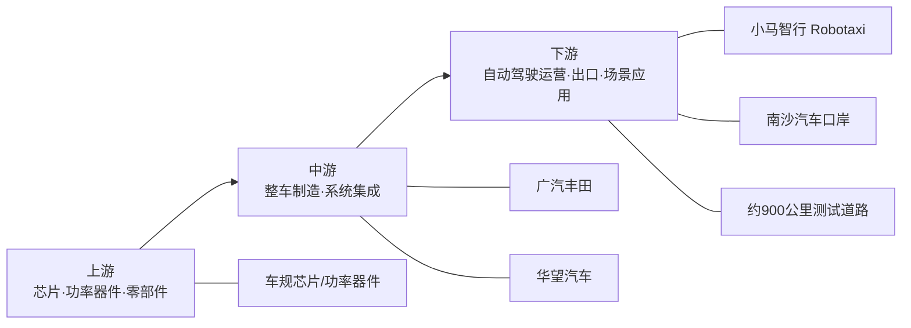

#### 船舶与海洋工程

南沙船海赛道的公开龙头极为清晰：广船国际、黄埔文冲，以及位于龙穴岛的中船龙穴造船基地。“梦想”号和“苏海1号”等项目说明，南沙的优势不仅在造船能力，也在高端海工和特种船舶总装能力。citeturn44view0turn23search4turn23search8turn27view0

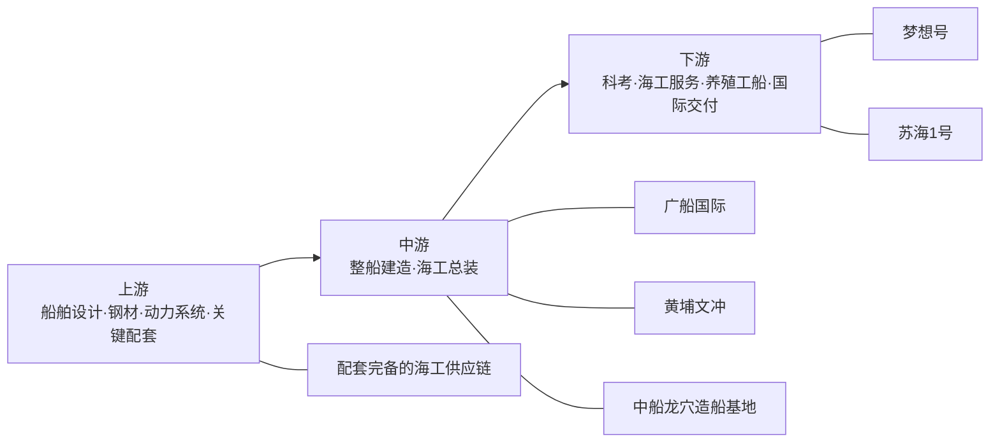

#### 生物医药与健康

南沙已公开的主体包括龙沙制药、国药控股、联瑞制药，以及广东医谷、大湾区精准医学研究院（广州）、横沥生物医药产业园、华创智慧医疗健康产业园和多家高水平医院。该赛道的特色，是把“研发—生产—流通—临床”四段都放在区内组织。citeturn44view0turn29search1turn43search6turn27view0

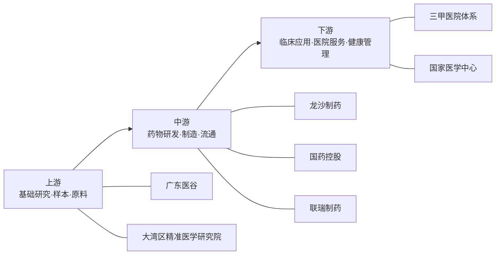

#### 低空经济与航空航天

这一赛道已形成较强的“测试平台 + 研究院 + 场景 + 企业导入”组合。公开主体包括中科宇航、广州低空经济产业发展有限公司、广东空天科技研究院（南沙）、港科大（广州）低空经济研究院和全国首座低空风洞。南沙的打法并不只做飞行器制造，而是同时做测试、培训、运营和空域场景。citeturn21search3turn22search5turn27view0turn28view0turn44view0

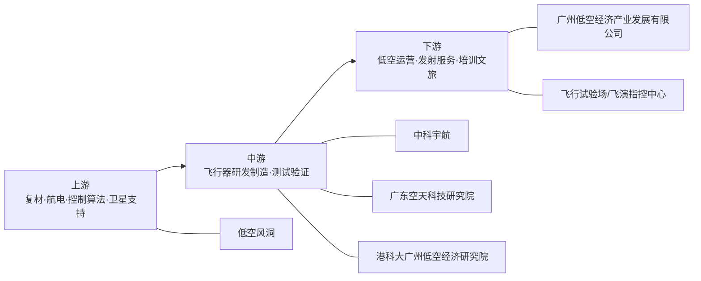

#### 半导体与集成电路

南沙半导体的产业链轮廓已经比较完整，公开企业包括芯粤能、芯聚能、晶科电子、南砂晶圆，官方还明示已形成“材料—设备—制造—封测”全链条。与珠三角很多以设计或封测为主的园区相比，南沙更强调功率半导体和制造环节。citeturn21search1turn21search5turn44view0turn29search0

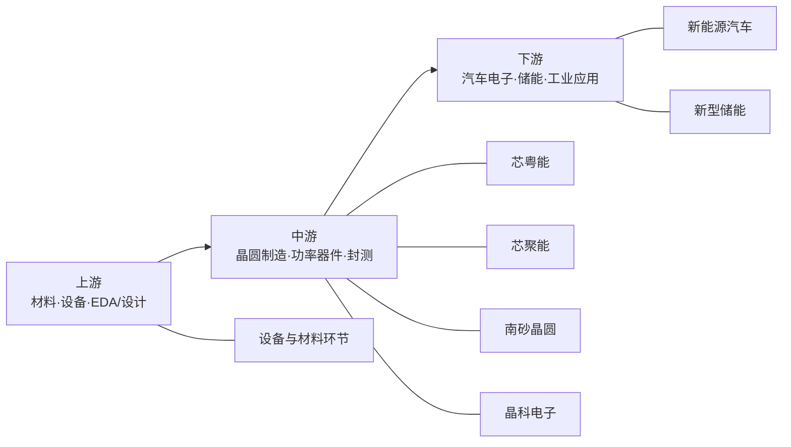

#### 绿色石化与新材料

这一链条的公开特征是“世界 500 强化工底座 + 本地终端应用导入”。沙伯基础、巴斯夫是最核心公开支柱，黄阁新材料化工园则体现出继续引入中下游项目的意图。南沙在这一赛道更像材料枢纽，而不是单纯基础化工基地。citeturn44view0turn23search1turn23search5

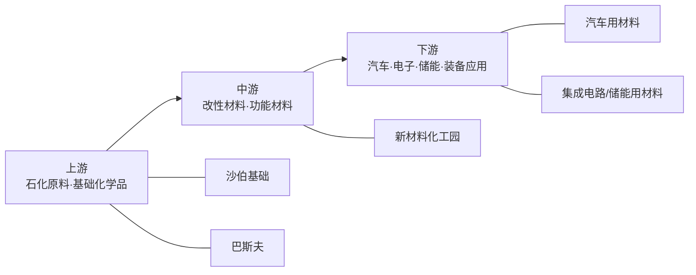

#### 新能源与新型储能

南沙新能源与新型储能已经从“布局”进入“项目密集落地”阶段。公开项目包括融捷能源、巨湾技研、易能时代等，官方明确形成了从核心材料、电池制造到储能系统、终端应用的完整链条。citeturn22search3turn22search6turn22search9turn44view0

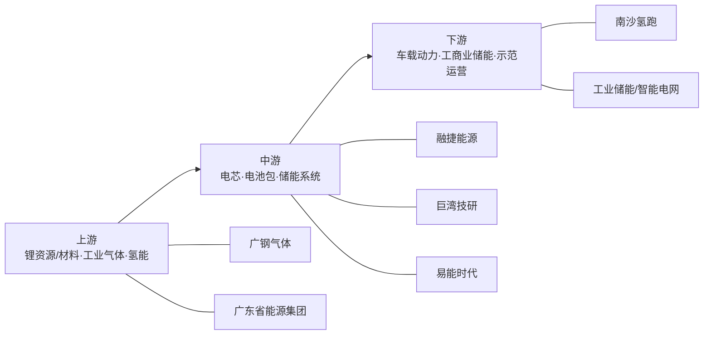

#### 智能装备与机器人

南沙机器人赛道的公开特色是“海工/特种机器人”，而非传统通用工业机器人。官方已公开的成果包括全国产海底作业机器人、海底管缆埋设机器人、海洋机器人集群应用技术研发平台和广东省实验室深海智能装备概念验证中心；但代表企业名称尚未在统一页面上被集中披露。citeturn44view0turn27view0turn28view0

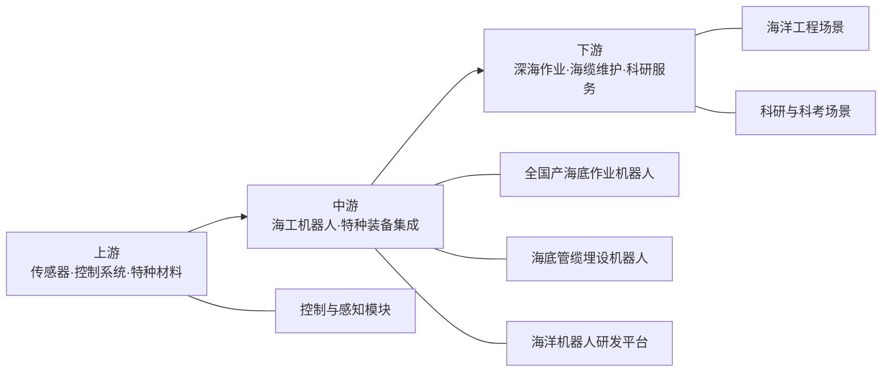

### 两个现代服务业

#### 现代金融业

南沙金融业已从“牌照集聚”进入“功能集聚”阶段。公开承载体包括广州期货交易所、摩根大通期货等持牌机构，以及融资租赁、QFLP/QDLP、FT 账户、IFF 永久会址等平台与机制。其核心作用，是为制造业、航运和跨境贸易提供定制化金融服务。citeturn23search2turn23search6turn30search0turn48search11

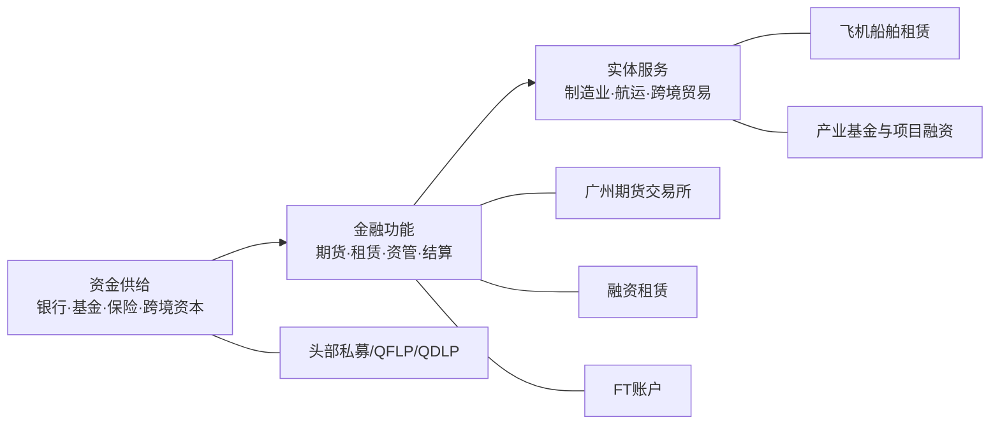

#### 物流与供应链

南沙物流与供应链并不是一般意义上的仓储物流，而是“港口—综保—跨境电商—汽车出口—供应链服务”一体化体系。公开节点包括广州港南沙港区、南沙综保区、南沙国际物流中心、中国（广州）汽车出口基地和全球退货中心仓。citeturn27view0turn24view0turn30search2turn44view0

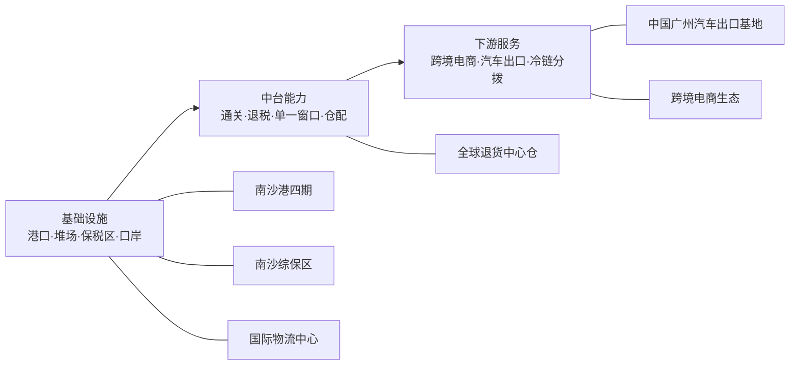

### 三个未来产业

#### 智能无人系统

这是南沙最具辨识度的未来产业之一。公开主体包括小马智行、雷迅创新、广东智能无人系统研究院（南沙）、港科大（广州）低空经济研究院、国际先进技术应用推进中心（大湾区）和粤港澳大湾区应用场景创新中心。它与低空经济赛道关系很近，但边界更广，涵盖海陆空全空间无人装备及其监管运营体系。citeturn22search2turn21search3turn21search4turn27view0

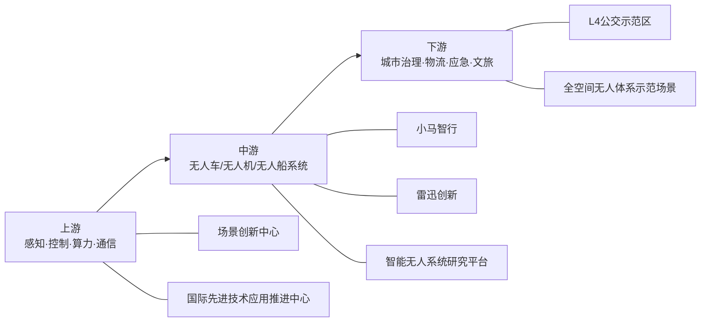

#### 细胞与基因

细胞与基因赛道的特点是“平台先行、临床牵引”。官方公开了超 40 家企业、公共服务中心、华创智慧医疗健康产业园以及四个病种全国首例临床应用突破，但并未在统一页面上集中披露完整龙头企业名单，因此更适合把它理解为一个由**公共服务平台 + 医疗机构 + 创新企业**共同构成的生态。citeturn44view0turn27view0

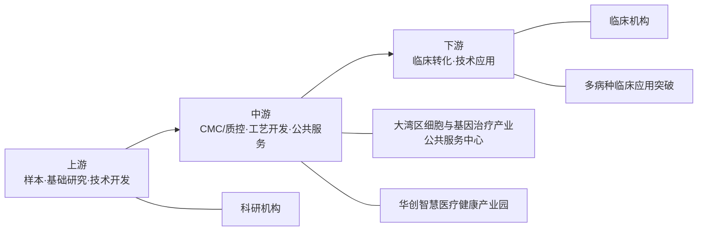

#### 深海深空

深海深空是南沙未来产业中战略属性最强、商业化节奏相对最慢的一条赛道。公开主体包括“梦想”号、海斗一号、冷泉生态系统研究装置、崂山实验室广州研究院、中科宇航等。南沙在这条链上最大的价值，不一定是短期营收，而是形成国家级装备、科学装置与产业外溢能力。citeturn23search4turn27view0turn28view0turn44view0

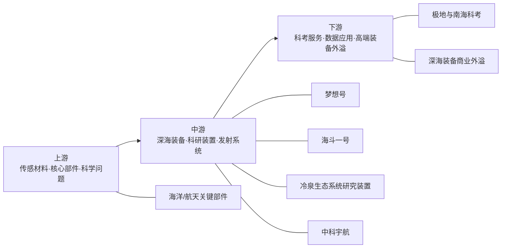

## 竞争力比较与SWOT

从官方口径看，广州正在构建“12218”现代化产业体系，深圳已经迭代到“20+8”2.0，东莞则在“8+4”基础上持续完善“8+8+4”。相较之下，南沙“8+2+3”门类更少，但并不是“能级更低”，而是**更强调区位禀赋驱动的聚焦式配置**：港口开放、综保枢纽、跨境金融、深海深空、全空间无人体系场景，是南沙与其他珠三角城市最大的差异化来源。以下比较包含部分研究性判断，已在结论中明确标注。citeturn34search2turn47search0turn47search10turn47search1turn44view0

### 与珠三角主要城市/区的比较

| 对比对象 | 官方产业体系 | 与南沙可比的重点 | 研究判断 |
|---|---|---|---|
| 广州全市 | 12218：15 个战略性产业集群、6 个未来产业、8 个现代服务业 | 南沙的 8+2+3 与广州总框架同向，但更聚焦港航物流、金融开放、船海、无人体系、深海深空 | 南沙是广州总体产业版图中的“开放型平台区 + 未来产业实验区”。citeturn34search2turn35search0turn44view0 |
| 深圳 | 20+8 2.0 版本，战略性新兴产业门类更广，新增低空经济与空天、人工智能等重点集群 | 深圳更强于数字技术、企业密度和多赛道并进；南沙更强于港口、综保、市场准入改革和全空间无人综合场景 | 据此推断，深圳更像高创新密度“总平台”，南沙更像制度创新和场景联动的“特种平台”。citeturn47search0turn47search6turn44view0turn48search9 |
| 东莞 | 2024 年构建“8+4”战略性新兴产业和未来产业体系，2025 年强调持续完善“8+8+4”产业体系 | 东莞更强调市镇协同、制造业链主、量产承载与电子信息腹地；南沙更强调港口通道、金融开放和政策场景 | 据此推断，东莞更适合规模制造放大，南沙更适合“外向型制造 + 跨境服务 + 战略平台”耦合。citeturn47search10turn47search1turn44view0turn24view0 |

### SWOT 分析

| 维度 | 主要内容 |
|---|---|
| 优势 | 国家级《南沙方案》、市场准入改革、“南沙金融30条”、15% 企业所得税优惠、港口—综保—汽车出口—跨境电商通道、大科学装置与高研发强度，构成“制度 + 口岸 + 科创 + 场景”复合优势。2025 年南沙已形成 1 个千亿级、4 个 300 亿元以上产业集群。citeturn48search2turn48search9turn48search11turn24view0turn27view0 |
| 劣势 | 统计数据仍存在口径不够统一的问题，尤其是“8+2+3”按赛道连续数据较少；2024 年 GDP、规上工业和固投均出现明显回调，说明产业结构仍受汽车和外贸周期影响较大；部分未来产业仍处在“项目密集、营收有限”的早期阶段。citeturn14search7turn11view0turn46view0turn44view0 |
| 机会 | 广州“12218”、广东低空和机器人政策、国家未来产业政策、跨境金融政策叠加，有利于南沙继续把低空、无人体系、细胞与基因、集成电路等赛道做深；2025 年半导体、生物医药与健康集群已入选省级中小企业特色产业集群。citeturn31search1turn41search0turn43search0turn30search0turn27view0 |
| 威胁 | 南沙对外贸、汽车出口、港航周期较敏感，若外需或国际贸易环境波动，容易传导至工业和物流链；同时，高端人才与创新企业将持续与深圳、上海、苏州等强创新区域竞争。后者属于基于现有产业结构和出口依赖所作推断。citeturn27view0turn24view0turn21search4turn44view0turn47search0 |

## 机遇风险与建议

### 机遇与风险

如果把“8+2+3”拆成要素维度看，南沙最强的机遇主要来自**技术平台、制度红利、港口通道、场景开放和跨境金融**；最核心的风险则是**高资本开支、统计口径碎片化、未来产业商业化周期长，以及外部环境冲击**。这不是一般园区常见的“招商风险”，而是国家战略平台在从“政策高地”转向“产业高地”过程中必然面对的结构性风险。citeturn27view0turn24view0turn48search9turn30search0turn30search2

| 维度 | 主要机遇 | 主要风险 | 对“8+2+3”的含义 |
|---|---|---|---|
| 技术 | 冷泉装置、深海装备概念验证中心、低空风洞、港科大（广州）等平台汇聚，形成“科学装置 + 产业测试”组合 | 集成电路、深海深空、细胞与基因等赛道验证周期长、失败率高 | 南沙适合做“硬科技中试与场景转化平台”，不宜只追求短期产值。citeturn27view0turn28view0turn21search3 |
| 人才 | 粤港澳人才协作、国际人才港、青年人才政策密集 | 高端人才与深圳、上海等地竞争激烈 | 需要把“人才政策”转成“可在地成就机会”，否则政策吸引力会衰减。citeturn27view0turn24view0turn28view0 |
| 资金 | 金融业支持办法、融资租赁、QFLP/QDLP、FT 账户、产业基金丰富 | IC、低空、海工装备、CGT 属于高投入赛道，回报周期偏长 | 应当把资金更多投向链条缺口和共享平台，而非分散撒胡椒面。citeturn30search0turn23search6turn48search11 |
| 政策 | 国家赋权最强，市场准入、税收、金融、场景叠加 | 部分政策更新较快，企业对适用期、兑现规则和叠加规则理解成本高 | 需要建立“8+2+3 一揽子政策导航”与年度更新机制。citeturn48search9turn29search10turn30search2turn30search3 |
| 国际环境 | 港口和跨境优势使南沙更容易承接国际资源 | 同时也意味着南沙更暴露于出口波动、技术管制和跨境合规压力之下 | 要把供应链韧性与国际合规能力纳入产业政策。此为基于外贸和出口结构的研究判断。citeturn27view0turn24view0 |

### 发展建议

下表面向四类主体给出可执行建议。它们不是抽象口号，而是基于南沙当前公开政策和短板所对应的优先动作。citeturn27view0turn29search10turn30search0turn30search2turn30search3turn22search5

| 主体 | 优先行动项 | 为什么要先做 |
|---|---|---|
| 政府 | 建立统一的“8+2+3 统计看板”，至少按赛道持续披露企业数、四上数、投资额、营收、从业、重点项目开工/投产数；同步发布官方产业链图谱和园区承载图 | 目前南沙最明显的短板不是没有数据，而是数据分散、口径不统一，导致外界难以判断赛道真实成熟度 |
| 政府 | 把市场准入改革与场景采购、场景开放结合，重点用于智能无人系统、低空、细胞与基因、智慧医疗、港航数字化 | 南沙最大的差异化优势在“制度 + 场景”，不是单纯补贴金额 |
| 园区 | 推行“一园一主链一公共平台”模式：万顷沙聚焦 IC 与储能，大岗聚焦低空无人，龙穴聚焦船海，横沥聚焦生物医药与细胞基因，黄阁聚焦汽车和新材料 | 园区如果主链不清晰，容易形成低水平重复招商 |
| 园区 | 优先建设共享中试、检测、适航/海工测试、质控评价、数据合规和知识产权服务平台 | 南沙前沿赛道多，真正缺的是“共性基础设施”而不是单一办公楼 |
| 企业 | 对制造企业，建议把“港口/出口/综保/融资租赁/跨境结算”作为商业模式的一部分，而非附属工具 | 南沙最稀缺的价值，是把制造、贸易和金融打通 |
| 企业 | 对低空、无人、细胞与基因、深海深空企业，优先争取南沙首试首用、示范订单和公共平台入驻资格 | 南沙的强项是“首场景”，企业应优先占据应用入口 |
| 投资者 | 采用“链条补缺 + 平台资产 + 场景运营”三类配置，而非只押单个硬科技项目 | 在高资本赛道中，平台与运营资产往往比单项目更具稳定回报 |
| 投资者 | 对集成电路、细胞与基因、深海深空等赛道，提高对政策周期、监管节奏和技术验证节点的尽调权重 | 这些赛道不是没有机会，而是估值和兑现时间必须更谨慎 |

### 主要来源链接清单

| 来源 | 主要用途 | 链接 |
|---|---|---|
| 《广州南沙产业结构》 | “8+2+3”官方完整清单与各赛道定义 | citeturn44view0 |
| 《2025年国民经济和社会发展计划执行情况与2026年计划草案的报告》 | 2025 年最新年度指标、项目、产业集群、未来产业进展 | citeturn27view0 |
| 《2026年政府工作报告》 | “十四五”五年产业成果、集群层级、市场主体、道路测试里程 | citeturn24view0 |
| 《2025年政府工作报告》 | 2024 年度回顾、2024 年产业与创新数据 | citeturn28view0 |
| 《2023年广州南沙国民经济和社会发展统计公报》 | 2023 年 GDP、工业总产值、行业结构 | citeturn11view1 |
| 《2022年广州南沙区国民经济和社会发展统计公报》 | 2022 年 GDP、工业、投资 | citeturn13view2 |
| 《2021年广州南沙区国民经济和社会发展统计公报》 | 2021 年 GDP、工业、投资 | citeturn13view0turn13view1 |
| 《2025年1-12月南沙区主要经济指标完成情况》 | 2025 年 GDP、工业增速、社零、港口、进出口 | citeturn10view0turn11view0 |
| 《2026年1-3月南沙区主要经济指标完成情况》 | 截至 2026-05-16 最新公开季度数据 | citeturn45view0turn46view0 |
| 南沙区第五次全国经济普查公报（第六号） | 战新产业、高技术产业、数字经济核心产业数据 | citeturn17view0 |
| 南沙区第五次全国经济普查公报（第三号、第四号、第五号、第七号） | 工业、科研服务、批零、全区单位与从业人员数据 | citeturn19view0turn19view1turn19view2turn19view4turn19view5turn18view0 |
| 《国务院关于印发广州南沙深化面向世界的粤港澳全面合作总体方案的通知》 | 国家级总纲政策 | citeturn48search2 |
| 《关于支持广州南沙放宽市场准入与加强监管体制改革的意见》 | 市场准入改革、全空间无人体系、生物医药准入 | citeturn48search9turn43search6 |
| 《关于推动未来产业创新发展的实施意见》 | 未来产业国家层面顶层文件 | citeturn43search0 |
| 《广东省推动低空经济高质量发展行动方案（2024—2026年）》 | 省级低空产业框架 | citeturn39search0 |
| 《广东省推动人工智能与机器人产业创新发展若干政策措施》 | 省级 AI 与机器人赛道政策 | citeturn41search0 |
| 《广州市人民政府办公厅关于印发广州市推动低空经济高质量发展若干措施的通知》 | 市级低空政策 | citeturn31search1 |
| 《广州市人民政府办公厅关于印发广州市进一步促进软件和信息技术服务业高质量发展的若干措施的通知》 | 市级软件和信息服务业政策 | citeturn31search2 |
| 《广州市汽车产业中长期发展规划》 | 市级汽车产业总规划 | citeturn31search3 |
| 《广州南沙促进生物医药产业高质量发展扶持办法》 | 区级生物医药专项政策 | citeturn29search1 |
| 《广州南沙海陆空全空间无人体系建设和低空经济高质量发展行动计划》 | 区级低空/无人体系行动路径 | citeturn22search5turn22search8 |
| 《广州市南沙区推动工业企业规模效益双倍增若干措施》 | 区级制造业普惠支持政策 | citeturn29search10 |
| 《广州市南沙区促进金融业高质量发展扶持办法》 | 区级金融赛道政策 | citeturn30search0 |
| 《广州市南沙区促进航运物流业高质量发展扶持办法》 | 区级航运物流政策 | citeturn30search2 |
| 《广州市南沙区促进软件和信息技术服务业高质量发展扶持办法》 | 区级软件与数字经济政策 | citeturn30search3 |
| 《广州市南沙区促进半导体与集成电路产业高质量发展扶持办法》 | 区级集成电路专项政策 | citeturn29search0 |